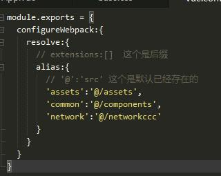
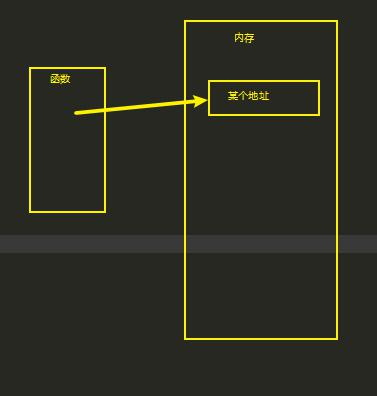
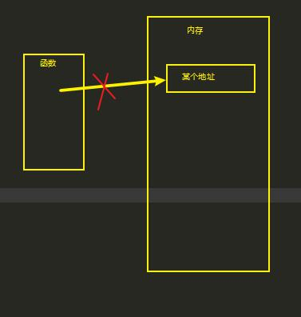
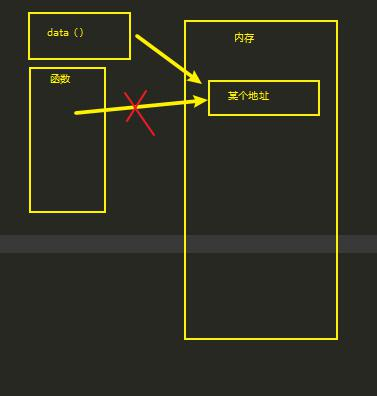

# mall

## Project setup
```
npm install
```
### Compiles and hot-reloads for development
```
npm run serve
```

### Compiles and minifies for production
```
npm run build
```

### Lints and fixes files
```
npm run lint
```

### Customize configuration
See [Configuration Reference](https://cli.vuejs.org/config/).

## 划分目录结构
## 引用css

## 起别名
新建一个个名为`vue.config.js`的文件，
里边这样写
## 统一写项目的规范
.editorconfig

## tabbar遇到的坑，
配置路由的时候，不有手误，routes不要写成routers
点击跳转，要写path路径，不要不会跳转。
## 替换图标
就是在public中找到替换favicon文件就行啦。
## 封装上边的导航栏
创建navbar组件，然后在navbar中写。
## 函数调用
1. 压入函数栈（保存函数调用过程中的所有变量）
2. 函数调用结束 : 弹出函数栈（释放函数中所有的变量）
## 函数的垃圾回收机制
1. 当我们在写调用函数的识货，函数指向内存的一个地址
2. 当函数运行完的时候，就不指向内存了。
3. 此时，没有人指向内存了，内存就被会收了，所以东西就不会保存。
4. 如果我们在函数运行的时候，让别的东西指向这个内存，那么这个内存就不会被回收。就还会保存。例如`this.result = res`就是把res指向内存的地址，给了data中的result。
 
 ## 轮播图
### 在轮播文件夹中加上一个index.js的作用
就是让他在其他文件中导入的时候方便
155-12分